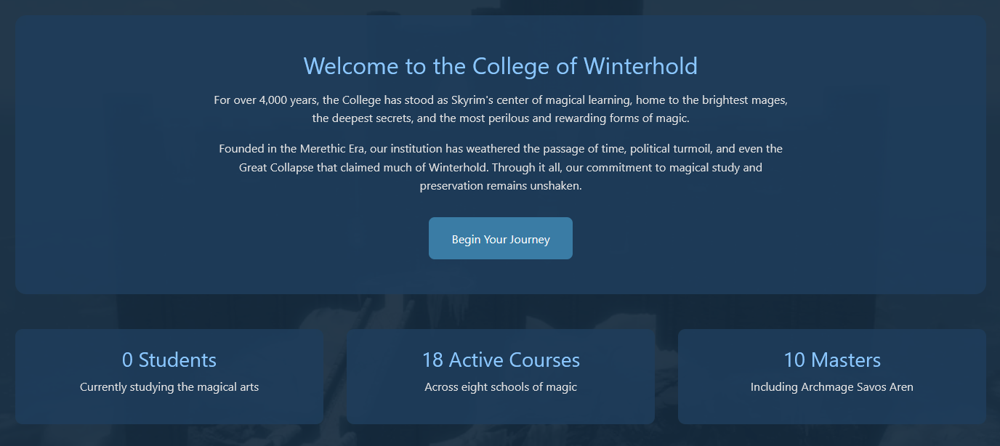
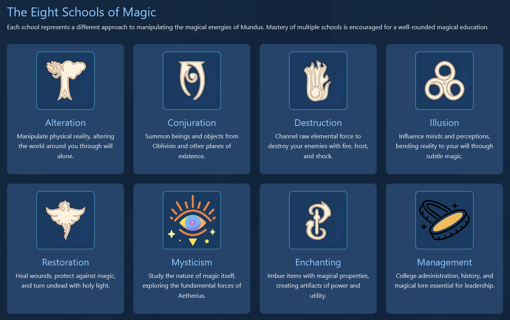
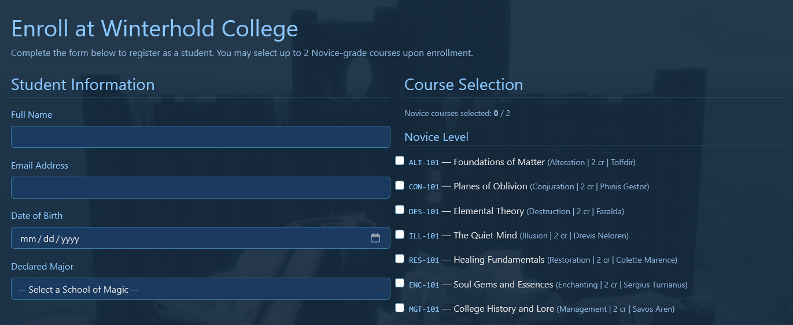
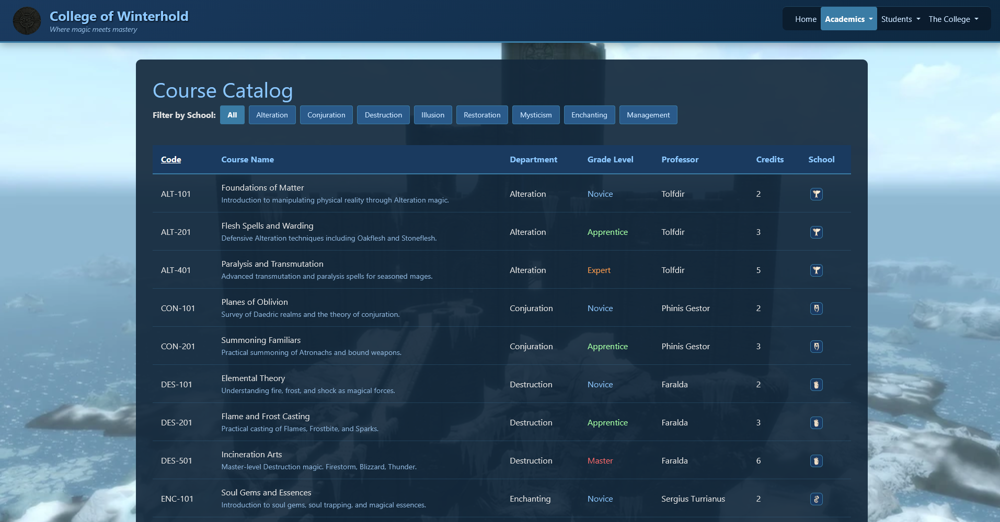
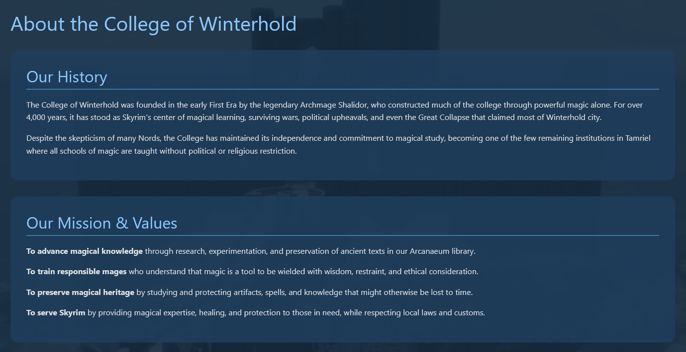

# Winterhold College Course Registration System

A comprehensive course registration web application built with **ASP.NET Core MVC**, **Entity Framework Core**, and **SQL Server**.
Designed to manage student enrollments, course offerings, and academic administration for Winterhold College.

Built as a project demonstrating full-stack .NET development with database integration and MVC architecture for a University course.

This system provides a digital platform for students to browse courses, and for administrators to in theory oversee the academic catalog.
The application implements role-based navigation and enforces academic policies such as novice-grade course limits during registration.

## Features

- **Course Catalog** – Browse courses organized by department and academic level
- **Student Enrollment** – Register for courses with validation against academic rules
- **Responsive Interface** – Clean, accessible UI built with CSS and HTML
- **Database Integration** – SQL Server backend with Entity Framework Core for data management
- **MVC Architecture** – Clean separation of concerns with Controllers, Models, and Views

## Screenshots

**Welcome**  


**Magic Departments**  


**Enrollment**  


**Course Catalog**  


**About**  


## Technologies Used

- **Frontend:** HTML5, CSS3, JavaScript, Razor Views
- **Backend:** C#, ASP.NET Core MVC
- **Database:** SQL Server, Entity Framework Core
- **Tools:** Visual Studio, Git

## Installation & Setup

### Prerequisites
- [.NET SDK](https://dotnet.microsoft.com/download) (version 6.0 or later)
- SQL Server (LocalDB, Express, or full instance)
- Visual Studio 2022 or later (recommended) / VS Code

### 1. Clone Repository
```bash
git clone https://github.com/Gloomcaller/Winterhold-College-Course-Registration-System.git
cd Winterhold-College-Course-Registration-System
```

### 2. Configure Database
Update the connection string in `appsettings.json` to point to your SQL Server instance:
```json
{
  "ConnectionStrings": {
    "DefaultConnection": "Server=(localdb)\\mssqllocaldb;Database=WinterholdCollegeDb;Trusted_Connection=True;MultipleActiveResultSets=true"
  }
}
```

### 3. Apply Database Migrations
```bash
dotnet ef database update
```

### 4. Run the Application with Blazor Pages
```bash
dotnet watch run
```

## License

This project is licensed under the **MIT License**.  
See the [LICENSE.txt](LICENSE.txt) file for more details.
